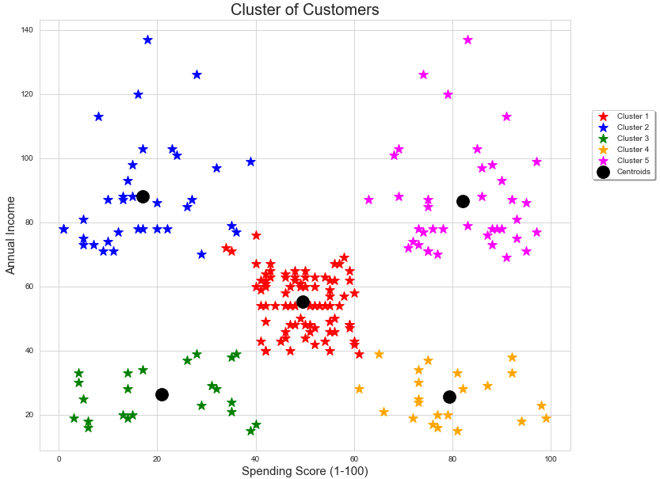

# Clustering-Customers-Behaviour

+ [Table of Contents](#sub-sub-heading-1)
    + [Credits](#credits)
    + [Project Goal and Procedure](#project-goal-and-procedure)
    + [Code and Resources](#code-and-resources)
    + [Part 1- Describing the dataset](#part-1--describing-the-dataset)
    + [Part 2- Correlation and Visualization of the Data](#part-2--correlation-and-visualization-of-the-data)
    + [Part 3- Clustering the customers](#part-3--clustering-the-customers)
    + [Part 4- Deriving possible marketing strategies and conclusion](#part-4--deriving-possible-marketing-strategies-and-conclusion)

 ### Credits: 
 A big thank you goes to [KenJee](https://www.youtube.com/channel/UCiT9RITQ9PW6BhXK0y2jaeg), [Codebasics](https://www.youtube.com/channel/UCh9nVJoWXmFb7sLApWGcLPQ), [Krish Naik](https://www.youtube.com/user/krishnaik06), [Keith Galli](https://www.youtube.com/channel/UCq6XkhO5SZ66N04IcPbqNcw)  and to the whole [Edureka Team](https://www.youtube.com/user/edurekaIN) who put a lot of effort to teach people Data Science,Machine Learning, Statistics and a lot of other related topics for free.
 
  ### Project Goal and Procedure
 * Goal: Clustering Shopping Mall customers in groups, based on spending patterns and yearly income  
 * Algorithm: K-Means Clustering 
 * Using dataset from [Kaggle.com](https://www.kaggle.com/)
 * visualization of data using seaborn and matplotlib packages
 * Using the Elbow-Method in order to find the optimum K-Value
 
 
 ### Code and Resources

* Python Version: 3.8
* Environment: Jupyter Notebook
* Packages: Pandas, Seaborn, Numpy, Scikit-learn

 ## Part 1- Describing the dataset 
 The dataset of this project comes from [Kaggle.com](https://www.kaggle.com/). Kaggle is a well known platform for Data Scientist and 
 Machine Learning engineers which is also used as a data resource for different projects. The ,,Mall" dataset, which is used in this project has 200 different customer information:
 * Customer ID
 * Gender
 * Age
 * Annual Income (in thousand USD)
 * Spending Score (1-100)
 
 The goal is to use the mentioned data and cluster the customer and behaviour patterns find which can be used for example for marketing purposes. 
 
 
 
 
 ## Part 2- Correlation and Visualization of the Data
 
 First, it is important to take a look if correlation between the features exist. Therefore, I decided to highlight the correlation between the numeric data:
 
 

 
It can be said that no meaningful correlation between the observed features exist.

The next graph illustrates the customers spending score (1-100), based on the annual income and separated by gender:

 
 
 ## Part 3- Clustering the customers
 
 In order to discover patterns in the customers spending behaviour, I will use the K-Means approach which is an unsupervised machine learning algorithm.
 The key attribute of unsupervised algorithms is the fact that we don't have known or labeled outcomes we can refer to. We can just try to identify certain similarities between a collection of data points.
 The main challenge in this approach is to identify the numbers of centroids which is a center of a cluster. The K-Means algorithm identifies the number of centroids and allocates every single data point to the nearest cluster.
 To determine the optimal number of clusters, the elbow method is often used. The elbow method plots the value of the cost function produced by different values of "k". If "k" increases, the distortion will decrease and all data points will be closer to their centroids. Nevertheless, the improvement in distortion will be smaller and smaller if "k" increases. To simplify the use case, it can be said that the ,,elbow" is nothing but the point of inflection on a curve. It is a good indication that the underlying model fits best at that point.
 In our example, the optimum value is "5":
 
 
 
 
 
After finding out the optimum numbers of clusters, we can visualize the outcome:

 
 
 ## Part 4- Deriving possible marketing strategies and conclusion
 In summary, we have 5 different clusters (red, blue, green, orange, magenta) and the respective centroids (black).
 
 * Cluster 3 (green): People with a low income and a low spending score
 * Cluster 4 (orange): Customers with a high spending score and a low annual income
 * Cluster 2 (blue): People with a low spending score and a high income
 * Cluster 5 (magenta): Individuals with a high spending score and a high annual income
 * Cluster 1 (red): ,,Average" spending score and ,,average" annual income
 
 Given this information, the next step is to find out how certain customers can be approached and how a proper marketing strategy can be developed.

For example, one business strategy can be to target customers from cluster 5 (high spending score and high income) when new offers ar introduced  because we know for sure that these people are willing to pay for our service and also have a high salary. Chances are high that further products can be sold to them. 
On the other side, the company (if it pursues ethical standards and wants to act social responsible), can target the people from cluster 4 (low income, high spending score) less frequent with ,,irresistable offers". 
 
